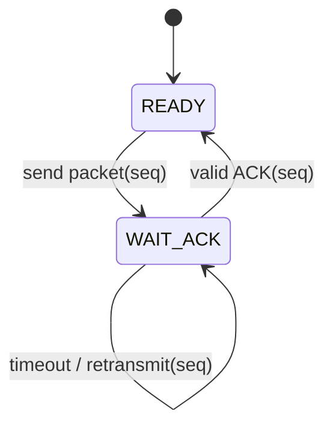
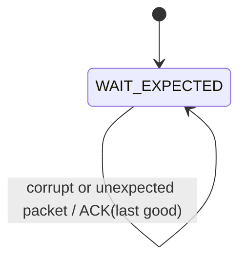
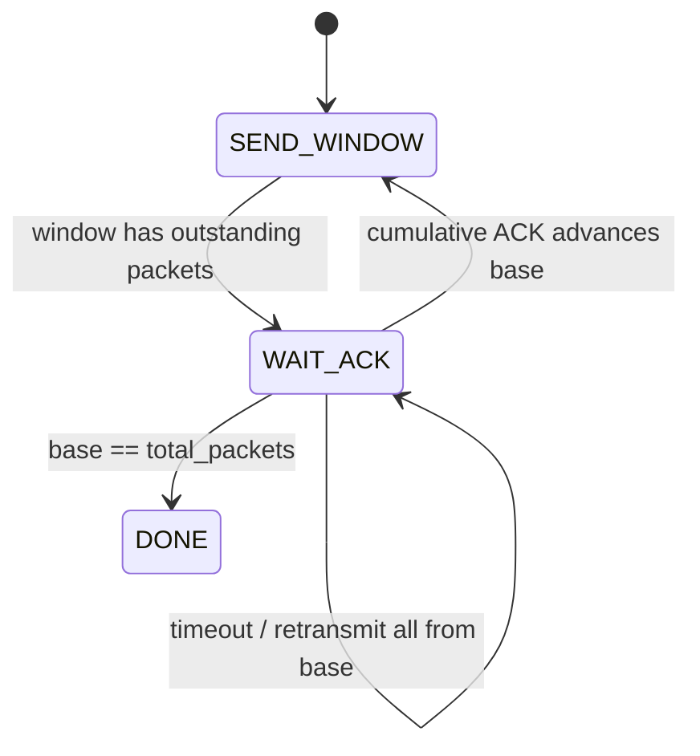
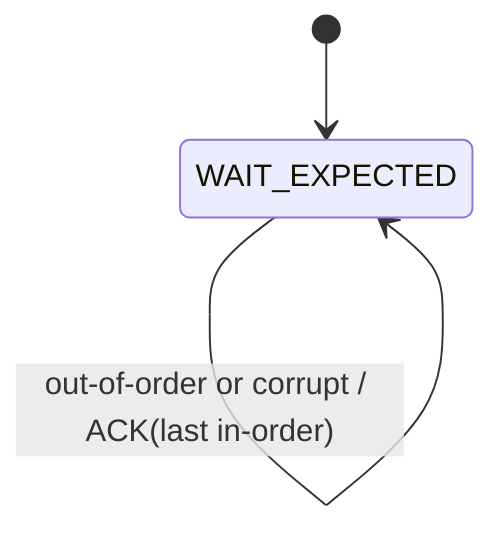
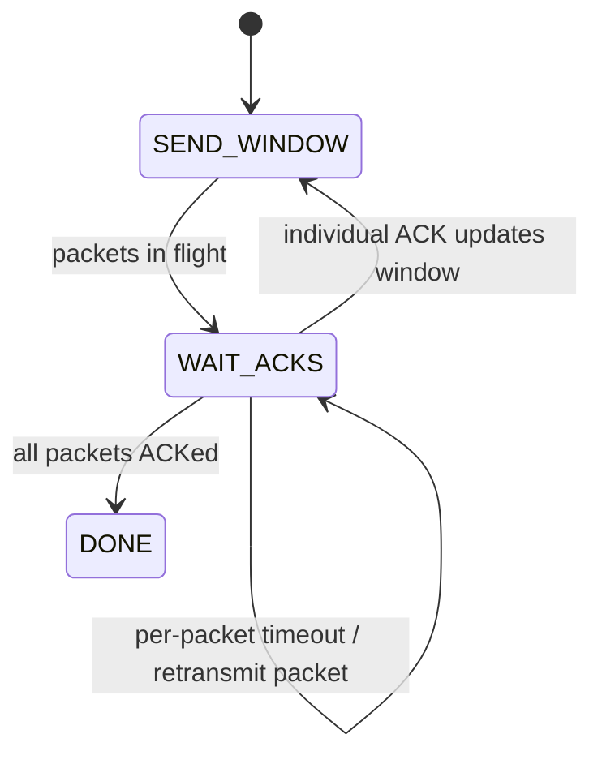
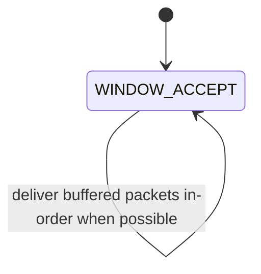

# Assignment 3 Report

## Course
CS3001 - Computer Networks (Spring 2026)

## Topic
Reliable Data Transfer: rdt 3.0, Go-Back-N, Selective Repeat

## 1. Overview
This implementation simulates reliable data transfer over an unreliable network.

Implemented protocols:
- rdt 3.0 (Stop-and-Wait)
- Go-Back-N (GBN)
- Selective Repeat (SR)

Simulation behavior:
- Data flow is unidirectional (sender to receiver).
- ACK/control flow is bidirectional (receiver to sender).
- The channel randomly introduces packet loss, corruption, and delay.

## 2. Implementation Summary
Language used: Python

Core file:
- `simulator.py`

Main details:
- Event-driven simulation with a virtual clock.
- Packet checksum (CRC32) for corruption detection.
- Retransmission using fixed timeout.
- Configurable packet count and payload size.
- Configurable loss/corruption/delay probabilities.
- Configurable GBN/SR window size.

### 2.1 rdt 3.0 (Stop-and-Wait)
- Sender sends exactly one packet and waits for ACK.
- Timeout triggers retransmission of the same packet.
- Receiver accepts only the expected sequence number.
- Receiver sends ACK for the last correctly received sequence.

### 2.2 Go-Back-N (GBN)
- Sender pipelines up to N unacknowledged packets.
- Receiver accepts only in-order packets and discards out-of-order packets.
- Receiver sends cumulative ACKs.
- Sender uses one timer for the oldest unacknowledged packet.
- Timeout causes retransmission from base to next_seq - 1.

### 2.3 Selective Repeat (SR)
- Sender pipelines up to N packets.
- Receiver accepts out-of-order packets and buffers them.
- Sender uses per-packet timers.
- Timeout retransmits only the missing/corrupted packet.
- Buffered packets are delivered in-order once gaps are filled.

## 3. FSM Diagrams

### 3.1 rdt 3.0 Sender FSM


### 3.2 rdt 3.0 Receiver FSM


### 3.3 GBN Sender FSM


### 3.4 GBN Receiver FSM


### 3.5 SR Sender FSM


### 3.6 SR Receiver FSM


## 4. Testing Scenarios
The assignment-required scenarios were tested:
- No packet loss/corruption.
- Packet loss.
- Packet corruption.
- Delayed packets.

Command used:

```powershell
python A03/simulator.py --run-tests
```

## 5. Testing Results
Observed output summary:

| Protocol | Scenario    | Result | Delivered |
|----------|-------------|--------|-----------|
| rdt      | clean       | PASS   | 20/20     |
| rdt      | loss        | PASS   | 20/20     |
| rdt      | corruption  | PASS   | 20/20     |
| rdt      | delay       | PASS   | 20/20     |
| gbn      | clean       | PASS   | 20/20     |
| gbn      | loss        | PASS   | 20/20     |
| gbn      | corruption  | PASS   | 20/20     |
| gbn      | delay       | PASS   | 20/20     |
| sr       | clean       | PASS   | 20/20     |
| sr       | loss        | PASS   | 20/20     |
| sr       | corruption  | PASS   | 20/20     |
| sr       | delay       | PASS   | 20/20     |

Overall status: PASS

## 6. How Reliability Is Ensured
- Sequence numbers identify packet ordering and duplicates.
- Checksum detects corruption.
- ACKs confirm successful receipt.
- Timeout + retransmission handles loss and excessive delay.
- GBN and SR use sliding windows to improve throughput vs Stop-and-Wait.

## 7. Conclusion
All required protocols were implemented and tested under all required scenarios. The simulator delivers complete and correct data despite packet loss, corruption, and delay, matching the assignment requirements.
